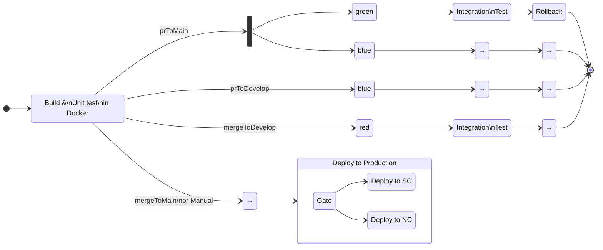




{: width="{{ site.imageWidth }}" }

This is the fifth in a series of posts about creating reusable Azure DevOps YAML pipelines across many projects. In these posts, I'll start with simple CI/CD pipelines and progress to a complex, dynamic pipeline.

1. [CI/CD YAML Pipelines](/2024/08/10/typical-pipeline.html)
1. [Creating a Build Pipeline Template](/2024/08/11/build-template-repository.html)
1. [Creating a Deploy Pipeline Template](/2024/08/21/deploy-template-repository.html)
1. [Adding "feature flags" to a pipeline](/2024/08/15/feature-flags.html)
1. Dynamic CI/CD Pipeline (this post)
1. [Azure DevOps Pipeline Tips and Tricks](/2024/08/22/azdo-tat.html)

This post assumes you are familiar with Azure DevOps concepts and YAML pipelines. If you need a refresher, check out my first [post](/2024/08/10/typical-pipeline.html) in this series.

## The Problem

This is a true story. The events depicted took place in Azure DevOps in 2024. At the request of the survivors, the names have been changed. Out of respect for the crashes, the rest has been told exactly as it occurred.

From management:

> We are outsourcing work overseas and need to standardize on branching, builds, and deployments for our 100+ deployables.

That sounded pretty scary, but we already had most of our CI/CD pipelines in Azure DevOps as YAML and had a bunch of YAML templates in a shared repo. As a DevOps developer, that sounded tedious, but not complex -- probably a matter of writing a few scripts. Then the other shoe dropped.

> After the build, we want the following to happen:
>
> - For a PR to `main`, deploy to the blue environment. *And* deploy to green, run integration tests, then rollback the deployment
> - For a PR to `develop`, deploy to the blue environment for any manual testing
> - For a push or merge to `develop`, deploy to the red environment and run integration tests
> - For the merge into `main`, kick off a gated deployment pipeline to production

And that is a simplification. There were actually seven different scenarios and four environments. Do _not_ ask me about why it was that way.

Translating that into a diagram:


<!-- This doesn't render in Jekyll -->


> NOTE: Each box with text represents a `stage` in the pipeline. The names on the lines are scenario names, which I will use throughout this post.

And given all that, we knew it was not the final word. There would be changes (and there were). One of the first things we did was to standardize the branching and pipelines.

As I started designing the pipeline, I found that the tricky part would be the conditional branching after the build stage. When adding conditions to pipelines in the past, I have used the template syntax such as `{{sBrace}}if{{eBrace}}`. That works if you have the values for the condition at compile-time, but in this case, I do not know everything at compile-time. In addition, any given app may opt out of the integration test stage. Given those requirements, the pipeline must dynamically determine the path it will take at runtime. That is the topic of this post.

## The Solution

Instead of the template syntax, I can use a `condition`, which is evaluated at runtime. By setting variables in the initial (build) stage of the pipeline, I can use them in `condition`s on the downstream `stages` and `jobs` to determine which path to take.

### High-Level Pipeline

For standardization, I created a high-level template that all the apps would use and then use feature flags (see this [post](/2024/08/15/feature-flags.html)) to enable or disable parts of the pipeline. Below are the `stages` for that template. Normally, five stages like this would create a line, but I'll tweak the `dependsOn` below to branch off the secondary deploy.

```yaml

stages:

  # All scenarios need build
  - template: ./dynamic-build.yml
    parameters:
      devOpsFolder: ${{ parameters.devOpsFolder }}
      isDryRun: ${{ parameters.isDryRun }}
      scenarioOverride: ${{ parameters.scenarioOverride }}

  # prToMain, prToDevelop, and mergeToDevelop deploy to primary environment
  - template: ./dynamic-deploy.yml
    parameters:
      devOpsFolder: ${{ parameters.devOpsFolder }}
      isDryRun: ${{ parameters.isDryRun }}
      environmentVariableName: primaryEnvironment

  # prToMain deploys to secondary environment
  - template: ./dynamic-deploy.yml
    parameters:
      devOpsFolder: ${{ parameters.devOpsFolder }}
      isDryRun: ${{ parameters.isDryRun }}
      environmentVariableName: secondaryEnvironment

  # prToMain and mergeToDevelop run integration tests
  - template: ./dynamic-integration-test.yml
    parameters:
      devOpsFolder: ${{ parameters.devOpsFolder }}
      isDryRun: ${{ parameters.isDryRun }}

  # prToMain has rollback
  - template: ./dynamic-rollback.yml
    parameters:
      devOpsFolder: ${{ parameters.devOpsFolder }}
      isDryRun: ${{ parameters.isDryRun }}

```

### Build Stage

The first stage in the pipeline is the build stage that uses the template from [this](/2024/08/11/build-template-repository.html) post. After the build, I added a step to determine the pipeline’s path.

These are the inputs that I need to set the path:

| Input          | From                                 | Known at compile-time |
| -------------- | ------------------------------------ | :-------------------: |
| sourceBranch   | Build.SourceBranch                   |          Yes          |
| prSourceBranch | System.PullRequest.SourceBranch      |          No           |
| prTargetBranch | System.PullRequest.TargetBranchName  |          No           |
| isPr           | System.PullRequest.PullRequestNumber |          No           |
| manualBuild    | Build.Reason == 'Manual'             |          Yes          |

> The needed `System.PullRequest.*` variables are not available at compile-time. The [documentation](https://learn.microsoft.com/en-us/azure/devops/pipelines/build/variables?view=azure-devops&tabs=yaml#system-variables-devops-services) for them has a column, `Available in templates`, to show which ones are available at compile-time, but that column may not show up depending on the width of your browser window. You can use the `Expand table` button to see it.
>
> In the real story, I needed to know if it was a draft PR, which is not available as a variable. To get that I had to make a REST call to get the PR details with the draft status.

Since I can't use template syntax (`{{sBrace}}if{{eBrace}}`) to conditionally create the path at compile-time, the pipeline will be created with *all* the stages and *all* the jobs. At run-time it will skip the ones that don't apply to the current scenario.

The added step is a PowerShell script that gets all the input values to determine which scenario this is. Then it sets variables in the pipeline that are used in downstream `stage` and `job` YAML. The output variables are:

| Variable Name        | Description                                                |
| -------------------- | ---------------------------------------------------------- |
| scenario             | Friendly name of the scenario                              |
| primaryEnvironment   | Primary environment to deploy to                           |
| secondaryEnvironment | Secondary environment to deploy to (only used in prToMain) |
| environments         | List of environments to deploy to                          |
| runIntegration       | Whether to run integration test `stage`                    |
| rollback             | Whether to run the rollback `stage`                        |

Here's the relevant part the `steps/set-pipeline-scenario.yml`. It's pretty much a big switch statement to figure out what variables need to be set for the downstream stages.

```powershell
if ($manualBuild -and $env:scenarioOverride -eq 'none') {
  # no deploys, but pipeline needs an environment, we'll just use blue
  $environments = 'blue'
  $scenario = 'manualBuild'

# PR to main
} elseif ($isPr -and $prTargetBranch -eq 'main'
              -or $env:scenarioOverride -eq 'prToMain') {
  $scenario = 'prToMain'
  $primaryEnvironment = 'green'
  $secondaryEnvironment = 'blue'
  $environments = 'green,blue'
  $runIntegration = 'True'
  $rollback = 'True'

# PR created against `develop`
} elseif ($isPr -and $prTargetBranch -eq 'develop'
             -or $env:scenarioOverride -eq 'prToDevelop') {
  $scenario = 'prToDevelop'
  $primaryEnvironment = 'blue'
  $environments = 'blue'

# PR merged/push into `develop`
} elseif (!$isPr -and $sourceBranch -eq 'refs/heads/develop'
             -or $env:scenarioOverride -eq 'mergeToDevelop') {
  $scenario = 'mergeToDevelop'
  $primaryEnvironment = 'red'
  $environments = 'red'
  $runIntegration = 'True'

# PR merged to `main`
} elseif (!$isPr -and $sourceBranch -eq 'refs/heads/main'
              -or $env:scenarioOverride -eq 'mergeToMain') {
  # no deployments, since deploy pipeline will take care of it
  $scenario = 'mergeToMain'
  $environments = 'blue,green,red,prod' # no deploys, eventually all these will go

} else {
  $scenario = 'fellThrough!'
  $environments = 'blue'
  "##vso[task.logissue type=warning]When setting build variables no conditions met. Check its output."
}

"##vso[task.setvariable variable=scenario;isOutput=true]$scenario"
"##vso[task.setvariable variable=environments;isOutput=true]$environments"
"##vso[task.setvariable variable=primaryEnvironment;isOutput=true]$primaryEnvironment"
"##vso[task.setvariable variable=rollback;isOutput=true]$rollback"
"##vso[task.setvariable variable=runIntegration;isOutput=true]$runIntegration"
"##vso[task.setvariable variable=secondaryEnvironment;isOutput=true]$secondaryEnvironment"
```

The last few lines above are the important part. The [setvariable](https://learn.microsoft.com/en-us/azure/devops/pipelines/scripts/logging-commands?view=azure-devops&tabs=bash#setvariable-initialize-or-modify-the-value-of-a-variable) commands tell AzDO to set those variables in the pipeline. `isOutput=true` tells AzDO that the variable will be available outside of the current job.

> 💁 Brief Lesson on Pipeline Variable Access
>
> The [documentation](https://learn.microsoft.com/en-us/azure/devops/pipelines/process/variables?view=azure-devops&tabs=yaml%2Cbatch#share-variables-across-pipelines) is pretty good, but their implementation can be a bit confusing.
>
> For example, if I use `##vso[task.setvariable variable=scenario;isOutput=true|false]$scenario` in `buildStep` step in `buildJob` job in `buildStage` stage.
>
> If `isOutput` is false you can only access it only from the current job using the macro syntax, or env variables.
>
> - `$(scenario)`
> - `$scenario` bash
> - `$env:scenario` PowerShell
>
> If `isOutput` is true you can access it from anywhere in the pipeline
>
> - same job: `$(buildStep.deployName)` 👈 since `isOutput=true`, syntax is different in same context
> - another job: `dependencies.buildJob.outputs['buildStep.deployName']`
> - another stage: `stageDependencies.buildJob.outputs['buildJob.buildStep.deployName']`
> - another job in another stage: `stageDependencies.buildStage.buildJob.outputs['buildStep.deployName']`
>
> To be able to access output from another `job` or `stage`, it must be in the `dependsOn` section, which I'll show below.

### Conditional Stages

After the build stage are: the deploy, integration test, and rollback stages, each of which will depend on the build stage to access the variables it sets. Here's the deploy stage's `dependsOn` section.

```yaml

stages:
  - stage: deploy_${{ lower(parameters.environmentVariableName) }}
    displayName: Deploy ${{ parameters.environmentVariableName }}
    dependsOn: [buildStage] # 👈 this puts the deploy after the build in the graph
                            # 👈 _and_ gets access to its variables

```

By default (without `dependsOn`), stages depend on their previous stage. Since there are two possible deployments, primary and secondary, both will depend on the build stage as shown below.


Since the same YAML is used for both deploys, an `environmentVariableName` variable is passed in from the calling template as `primaryEnvironment` or `secondaryEnvironment`, which are the names of variables set by the scenario script. For example, the stage name will be `deploy_primaryenvironment` or `deploy_secondaryenvironment` at compile-time.

As I mentioned at the beginning of this post, I will use `condition` to skip stages that are not needed. Here's the deploy stage's `condition`. (The default `condition` is `succeeded()` if it is not supplied.)

```yaml

condition: |
  and (
    succeeded(),
    # 👇 e.g. primaryEnvironment != ''
    gt(length(stageDependencies.buildStage.outputs['buildJob.set_pipeline_scenario.${{parameters.environmentVariableName}}']),0)
  )

```

That needs some explanation. To reuse the deploy pipeline for multiple environments, the `environmentVariableName` is passed in from the calling template ([above](#high-level-pipeline)) as `primaryEnvironment` or `secondaryEnvironment`. For the former, the compiled YAML will look like this (line breaks for readability):

```yaml

and (
  succeeded(),
  stageDependencies
    .buildStage
    .outputs['buildJob.set_pipeline_scenario.primaryEnvironment']
  )
)

```

Which is a long-winded way of saying, "Did the build succeed and is the `primaryEnvironment` scenario variable not empty?" (Empty is falsey in YAML.)

 `primaryEnvironment` or `secondaryEnvironment` will be empty for the `mergeToMain` scenario, and `secondaryEnvironment` will only have a value for the `prToMain` scenario. The previous image was `prToMain` so both ran. Below is a `prToDevelop` scenario, and only the primary ran.


The integration test is similar. It needs to depend on the primary deploy and the build stages so it can access the variables for the `condition`

```yaml

stages:
  - stage: integration_test
    displayName: Integration Test
    dependsOn: [deploy_primaryenvironment,buildStage]
    condition: |
      and(
        succeeded(),
        # 👇 primaryEnvironment != ''
        stageDependencies.buildStage.outputs['buildJob.set_pipeline_scenario.primaryEnvironment'],
        # 👇 runIntegration == 'True'
        eq(stageDependencies.buildStage.outputs['buildJob.set_pipeline_scenario.runIntegration'],'True')
      )

```

When there are multiple values in the `dependsOn`, the first one determines the order of the stages in the graph. In this case, the integration will come after the primary deploy. The `condition` for this stage is the same as the deploy with the addition of checking the `runIntegration` value set by the scenario script. Here's the integration test stage in action.


The rollback stage is slightly different. It will run even if the `integration_test` (its dependent) stage fails. I do that by *not* using `succeeded()`, but instead checking that the deploy stage succeeded. If the deploy failed, there is no need to run the rollback.

```yaml

stages:
  - stage: rollback
    displayName: Rollback
    dependsOn: [integration_test,buildStage,deploy_primaryenvironment]
    condition: |
      and(
        # 👇 primaryEnvironment != ''
        stageDependencies.buildStage.outputs['buildJob.set_pipeline_scenario.primaryEnvironment'],
        # 👇 rollback == 'True'
        eq(stageDependencies.buildStage.outputs['buildJob.set_pipeline_scenario.rollback'],'True'),
        # 👇 deploy succeeded
        eq(dependencies.deploy_primaryenvironment.result, 'Succeeded')
      )

```

Here's a pipeline that ran with a failing integration test, but the rollback still ran.


That covers the stages being run or skipped based on run-time variables. Next, I'll cover the jobs.

### Conditional Jobs

Since I don't know which environments need to run the deploy, integration test, or rollback, the stage must have a job for each one at compile-time. Even though the YAML is the same for the jobs, the variables for each are environment-specific. Since the variables are loaded at compile-time, I must have separate jobs.

Each stage's jobs are very similar, I will use the rollback stage as the example.

```yaml

jobs:
  - ${{ each env in split('red,blue,green', ',')}}:
    - job: rollback_${{ lower(env) }}
      displayName: Rollback ${{ env }}

```

I use the {{sBrace}}each{{eBrace}} syntax to loop over the environment list to create three jobs. Of course, I only want to run one of them at runtime, so I use a `condition` for that.

```yaml

condition: |
  and (
    succeeded(),
    # 👇 primaryEnvironment == $env
    eq(stageDependencies
        .buildStage
        .buildJob
        .outputs['set_pipeline_scenario.primaryEnvironment'], '${{env}}')
  )

```

As with the `stage`'s condition, I check the variable that the build stage set. Instead of just checking if it's empty, I check to see if it matches the value for this job's `env` value from the {{sBrace}}each{{eBrace}} loop. For each `stage,` there will be a `red`, `blue`, and `green` job, and the `primaryEnvironment` value will only match one so only one job runs. When viewing the pipelines’ jobs, only one environment ran in each `stage`, and it is the same for all stages. In the screenshot below, which was a `prToMain` scenario, the `green` job ran for each stage.


In a `mergeToDevelop` scenario, only the `blue` job ran, and the rollback stage was skipped.


## Summary

This was by far the most complicated pipeline I have ever created. It has served me well in my current position, as well as all of the templates. If you ever have a situation like this I hope this post and the sample code will save you some time.

If you view the sample code, you'll see a `scenarioOverride` parameter that can be set for manual builds. This is very useful for testing all the scenarios to make sure they run the correct stages and jobs. You may want to remove it when you are finished or leave it for future use. In the actual template I created, I left it in the template so it could be used, but the caller had to explicitly expose the parameter in their pipeline to make it visible. Once things work, you'll want to create PRs, pushes, etc. to test all the cases for real. Logging out the input and outputs of the scenario script is very helpful for debugging (not shown above, but in the YAML).

Build and deploys can take a long time. To shake out the conditional part of the pipeline, I recommend stubbing out the build and deploy until the pipeline is working correctly as I did for this sample.

Good luck, and watch your indenting!

## Links

- [This sample's source](https://dev.azure.com/MrSeekatar/SeekatarBlog/_git/TypicalPipeline) The DevOps files are in the DevOps-dynamic folder.
- [This sample's Build pipeline in Azure DevOps](https://dev.azure.com/MrSeekatar/SeekatarBlog/_build?definitionId=54)
- [The template repo](https://dev.azure.com/MrSeekatar/SeekatarBlog/_git/azdo-templates)

Azure DevOps documentation:

- [Sharing Variables in a pipeline](https://learn.microsoft.com/en-us/azure/devops/pipelines/process/variables?view=azure-devops&tabs=yaml%2Cbatch#share-variables-across-pipelines)
- [SetVariable Logging Command](https://learn.microsoft.com/en-us/azure/devops/pipelines/scripts/logging-commands?view=azure-devops&tabs=bash#setvariable-initialize-or-modify-the-value-of-a-variable) to set a variable in a step for use in another step or stage.
- [Conditions](https://learn.microsoft.com/en-us/azure/devops/pipelines/process/conditions?view=azure-devops&tabs=yaml%2Cstages)
- [Functions](https://learn.microsoft.com/en-us/azure/devops/pipelines/process/expressions?view=azure-devops#functions) for use in expressions. `and`, `or`, `contains`, etc.
- [Predefined Build Variables](https://learn.microsoft.com/en-us/azure/devops/pipelines/build/variables?view=azure-devops&tabs=yaml#build-variables-devops-services)
- [Predefined System Variables](https://learn.microsoft.com/en-us/azure/devops/pipelines/build/variables?view=azure-devops&tabs=yaml#system-variables-devops-services)
- [Set an output variable for use in future stages](https://learn.microsoft.com/en-us/azure/devops/pipelines/process/set-variables-scripts?view=azure-devops&tabs=bash#set-an-output-variable-for-use-in-future-stages)
