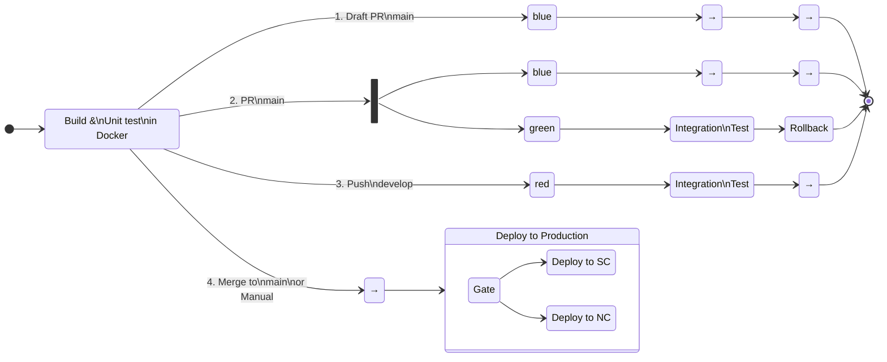




{: width="{{ site.imageWidth }}" }

This is the fifth in a series of posts about creating reusable Azure DevOps YAML pipelines across many projects. In these posts, I'll start with simple CI/CD pipelines and progress to a complex, dynamic pipeline.

1. [CI/CD YAML Pipelines](/2024/08/10/typical-pipeline.html)
1. [Creating a Build Pipeline Template](/2024/08/11/build-template-repository.html)
1. [Creating a Deploy Pipeline Template](/2024/08/21/deploy-template-repository.html)
1. [Using `extends` and "feature flags" in a pipeline](/2024/08/15/extends.html)
1. Dynamic CI/CD Pipeline (this post)
1. [Azure DevOps Pipeline Tips and Tricks](/2024/08/22/azdo-tat.html)

## The Problem

From management:

> We are outsourcing work overseas and need to standardize on branching, builds, and deployments for our 100+ deployables.

That sounds pretty scary, but we already had most of our CI/CD in Azure DevOps as YAML and had a bunch of YAML templates in a shared repo. As a DevOps developer that sounded tedious, but not complex. (Probably a matter of writing a few scripts.) Then the other shoe dropped (and this is a simplification. There were actually seven different scenarios and four build environments):

> For all our builds, we want the following to happen:
>
> - For a draft PR to `main`, deploy the build to the blue environment, for any manual testing
> - For a PR to `main`, deploy to blue, *and* deploy to green, run integration tests, then rollback the deployment
> - For a push to `develop`, push to red and run integration tests
> - For the merge into `main`, kick off a gated deployment pipeline to production

Translating that into a CI/CD pipeline state diagram:

<!-- This doesn't render in Jekyll -->

> NOTE: Each named box represents a stage in the pipeline. The numbers on the lines are scenarios numbers, which I will refer to throughout this blog.

And given all that, we knew that was not the final word. There would be changes. One of the first things we did was to standardize on the branching, and pipelines. See the previous blogs about leveraging a template repository to encapsulate nearly all the pipeline logic.

The interesting part of this is the four branches after the build stage. When adding conditions to pipelines in the past, I have used the template syntax such as `{{sBrace}}if{{eBrace}}`. That works if you have the values for the condition at compile-time, but in this case we do not know everything a compile-time. In addition, any given app may opt out of the integration test stage. Given those requirements, the pipeline must dynamically determine the path it will take at runtime. That is the topic of this blog.

## The Solution

In an Azure DevOps pipeline, you can put a `condition` on a `stage`, `job`, or `step` that is evaluated at runtime. By setting variables in the initial stage of the pipeline, I can then use `condition`s on the downstream `stages` and `jobs` to determine which path to take.

### Build Stage

The first stage in the pipeline is a build stage as using the template from [this](/2024/08/11/build-template-repository.html) blog post. In addition to building the image, I'll add a step to determines the path the pipeline will take.

To determine the path, these are the inputs that I need to know.

| Input          | From                                 | Known at Compile Time |
| -------------- | ------------------------------------ | :-------------------: |
| sourceBranch   | Build.SourceBranch                   |          Yes          |
| prSourceBranch | System.PullRequest.SourceBranch      |          No           |
| prTargetBranch | System.PullRequest.TargetBranchName  |          No           |
| isDraftPr      | GitHub/AzDO API Call                 |          No           |
| isPr           | System.PullRequest.PullRequestNumber |          No           |
| manualBuild    | Build.Reason == 'Manual'             |          Yes          |

If all of them were available at queue time I could use template syntax (`{{sBrace}}if{{eBrace}}` statements) to conditionally create the path. Since they aren't, the pipeline will be created will _all_ the stages and _all_ the jobs. At run time it will skip the ones that don't apply.

The step gets all the input values, then uses a switch statement to determine which scenario this it. Then it sets variables in the pipeline that are used in downstream `stage` and `job` YAML. The output variables are:

| Variable Name        | Description                                                  |
| -------------------- | ------------------------------------------------------------ |
| primaryEnvironment   | Primary environment to deploy to                             |
| secondaryEnvironment | Secondary environment to deploy to (only used in scenario 2) |
| deployType           | Friendly name of the path taken                              |
| runIntegration       | Whether to run integration test `stage`                      |
| rollback             | Whether to run the rollback `stage`                          |
| environments         | List of environments to deploy to                            |

- tell how to set variables in a step
- how to consume variables in a stage
- how to use them in conditions
- instead of draft use PR to test to avoid messing with the API call.
- note that policy in AzDO must be set to trigger PR
- set the trigger for src and build yaml??

In a step you can set a variable for use with the current job, or for use downstream.

## Links

Azure DevOps documentation:

- [Set an output variable for use in future stages](https://learn.microsoft.com/en-us/azure/devops/pipelines/process/set-variables-scripts?view=azure-devops&tabs=bash#set-an-output-variable-for-use-in-future-stages)
- [Conditions](https://learn.microsoft.com/en-us/azure/devops/pipelines/process/conditions?view=azure-devops&tabs=yaml%2Cstages)
- [Predefined Build Variables](https://learn.microsoft.com/en-us/azure/devops/pipelines/build/variables?view=azure-devops&tabs=yaml#build-variables-devops-services)
- [Predefined System Variables](https://learn.microsoft.com/en-us/azure/devops/pipelines/build/variables?view=azure-devops&tabs=yaml#system-variables-devops-services)
