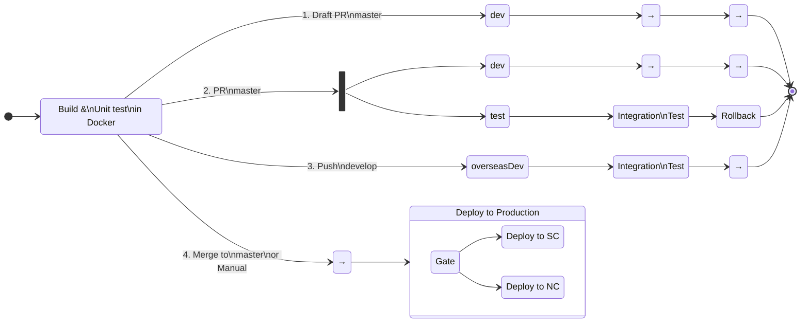

{: width="{{ site.imageWidth }}" }

## The Problem

"We are outsourcing work overseas and need to standardize on branching, builds, and deployments for our 100+ deployables."

We already had most of our CI/CD in Azure DevOps as YAML, so as the DevOps developer that sounded daunting and tedious, but not complex. Then the other shoe dropped (and this is a simplification. There were actually seven different scenarios and four build environments):

"For builds, we want the following to happen:
For a draft PR to master, deploy the build to the dev environment, for any manual testing
For a PR to master, deploy to dev. And deploy to test, run integration tests, then rollback the deployment
For a push to develop, push to offshore-dev and run integration tests
For the merge into master, kick off a gated deployment pipeline"

Translating that into a state diagram for the CI/CD pipelines is like this.

> Each named box represents a stage in the pipeline. The numbers on the arrows are scenarios numbers, which I will refer to throughout this blog.

The interesting part of this is the four branches after the build stage. You may have used `{{ if }}` to conditionally run parts of a YAML pipeline, but in this case we do not know everything a queue-time, so cannot use that syntax (template syntax). In addition, any given app may opt out of the integration test stage. Given those requirements, the pipeline must dynamically determine the path it will take at runtime. That is the topic of this blog.

## The Solution

In an Azure DevOps pipeline, you can put a condition on a stage, job, or step that is evaluated at runtime. By setting variables in the initial stage of the pipeline, I can then use conditions on the downstream stages and jobs to determine which path to take.

### Build Stage

The first stage in the pipeline is a typical build stage. It has steps for building a Docker image, running unit tests, publishing results, etc. One new step is one that determines the path the pipeline will take.

To determine the path, these are the inputs that I need to know.

| Input          | From                                 | Known at Queue Time |
| -------------- | ------------------------------------ | :-----------------: |
| sourceBranch   | Build.SourceBranch                   |         Yes         |
| prSourceBranch | System.PullRequest.SourceBranch      |         No          |
| prTargetBranch | System.PullRequest.TargetBranchName  |         No          |
| isDraftPr      | GitHub API Call                      |         No          |
| isPr           | System.PullRequest.PullRequestNumber |         No          |
| manualBuild    | Build.Reason == 'Manual'             |         Yes         |

If all of them were available at queue time I could use template syntax (`${{ if }}` statements) to conditionally create the path. Since they aren't, the pipeline will be created will _all_ the stages and _all_ the jobs in each one. At run time it will skip the ones that don't apply.

The step gets all the input values, then uses a switch statement to determine which scenario this it. Then it sets variables in the pipeline that are used in downstream stages and jobs. The output variables are:

| Variable Name        | Description                                                  |
| -------------------- | ------------------------------------------------------------ |
| primaryEnvironment   | Primary environment to deploy to                             |
| secondaryEnvironment | Secondary environment to deploy to (only used in scenario 2) |
| deployType           | Friendly name of the path taken                              |
| runIntegration       | Whether to run integration test stage                        |
| rollback             | Whether to run the rollback stage                            |
| environments         | List of environments to deploy to                            |

# Links

Azure DevOps documentation:

- [Predefined Build Variables](https://learn.microsoft.com/en-us/azure/devops/pipelines/build/variables?view=azure-devops&tabs=yaml#build-variables-devops-services)
- [Predefined System Variables](https://learn.microsoft.com/en-us/azure/devops/pipelines/build/variables?view=azure-devops&tabs=yaml#system-variables-devops-services)