


{: width="{{ site.imageWidth }}" }

This is the fifth in a series of posts about creating reusable Azure DevOps YAML pipelines across many projects. In these posts, I'll start with simple CI/CD pipelines and progress to a complex, dynamic pipeline.

1. [CI/CD YAML Pipelines](/2024/08/10/typical-pipeline.html)
1. [Creating a Build Pipeline Template](/2024/08/11/build-template-repository.html)
1. [Creating a Deploy Pipeline Template](/2024/08/21/deploy-template-repository.html)
1. [Adding "feature flags" to a pipeline](/2024/08/15/feature-flags.html)
1. Dynamic CI/CD Pipeline (this post)
1. [Azure DevOps Pipeline Tips and Tricks](/2024/08/22/azdo-tat.html)

## The Problem

From management:

> We are outsourcing work overseas and need to standardize on branching, builds, and deployments for our 100+ deployables.

That sounds pretty scary, but we already had most of our CI/CD in Azure DevOps as YAML and had a bunch of YAML templates in a shared repo. As a DevOps developer, that sounded tedious, but not complex -- probably a matter of writing a few scripts. Then the other shoe dropped.

> For all our builds, we want the following to happen:
>
> - For a PR to `main`, deploy to blue, *and* deploy to green, run integration tests, then rollback the deployment
> - For a PR to `develop`, deploy the build to the blue environment, for any manual testing
> - For a push to `develop`, push to red and run integration tests
> - For the merge into `main`, kick off a gated deployment pipeline to production

And that is a simplification. There were actually seven different scenarios and four build environments. Do _not_ ask me about why they wanted it this way.

Translating that into a CI/CD pipeline state diagram:

```mermaid
stateDiagram
    direction LR

    state "Build &\nUnit test\nin Docker" as b
    state fork <<fork>>

    state "→" as i1
    state "→" as i2
    state "Integration\nTest" as i21
    state "Integration\nTest" as i4

    state "→" as r1
    state "→" as r2
    state "Rollback" as r21
    state "→" as r4

    state "blue" as d1
    state "blue" as d2

    state "red" as nd
    state "green" as t
    state "→" as e2


    [*] --> b

    b --> fork : 1. PR\nmain
    fork --> d2
    d2 --> i2
    i2 --> r2
    r2 --> [*]
    fork --> t
    t --> i21
    i21 --> r21
    r21 --> [*]

    b --> d1 : 2. PR\ndevelop
    d1 --> i1
    i1 --> r1
    r1 --> [*]

    b --> nd : 3. Push\ndevelop
    nd --> i4
    i4 --> r4
    r4 --> [*]

    state "Deploy to Production" as pp
    b --> e2 : 4. Merge to\nmain\nor Manual
    e2 --> pp

state pp {
    direction LR
    state "Gate" as g
    g --> x
    g --> y
    state "Deploy to SC" as x
    state "Deploy to NC" as y
}
```


<!-- This doesn't render in Jekyll -->


> NOTE: Each box with text represents a `stage` in the pipeline. The numbers on the lines are scenarios numbers, which I will refer to throughout this post.

And given all that, we knew it was not the final word. There would be changes (and there were). One of the first things we did was to standardize on the branching and pipelines. (See the previous posts about leveraging a template repository to encapsulate pipeline logic.)

As I started designing the pipeline, I found that the tricky part would be the conditional branching after the build stage. When adding conditions to pipelines in the past, I have used the template syntax such as `{{sBrace}}if{{eBrace}}`. That works if you have the values for the condition at compile-time, but in this case I do not know everything a compile-time. In addition, any given app may opt out of the integration test stage. Given those requirements, the pipeline must dynamically determine the path it will take at runtime. That is the topic of this post.

## The Solution

Instead of the template syntax, I can put a `condition` on a `stage`, `job`, or `step` that is evaluated at runtime. By setting variables in the initial stage of the pipeline, I can use them in `condition`s on the downstream `stages` and `jobs` to determine which path to take.

### Build Stage

The first stage in the pipeline is a build stage as using the template from [this](/2024/08/11/build-template-repository.html) post. In addition to building the image, I added a step to determine the path the pipeline will take.

To determine the path, these are the inputs that I need to know.

| Input          | From                                 | Known at Compile Time |
| -------------- | ------------------------------------ | :-------------------: |
| sourceBranch   | Build.SourceBranch                   |          Yes          |
| prSourceBranch | System.PullRequest.SourceBranch      |          No           |
| prTargetBranch | System.PullRequest.TargetBranchName  |          No           |
| isPr           | System.PullRequest.PullRequestNumber |          No           |
| manualBuild    | Build.Reason == 'Manual'             |          Yes          |

> The needed `System.PullRequest.*` variables are not available at compile time. The [documentation](https://learn.microsoft.com/en-us/azure/devops/pipelines/build/variables?view=azure-devops&tabs=yaml#system-variables-devops-services) for them has a column `Available in templates`to show which ones are available at compile time, but that column may not show up depending on the width of your browser window. You can use the `Expand table` button to see it.
>
> For simplicity I left out needing to know if it was a draft PR, which is not available in the variables. In the real scenario I had to make a REST call to get the PR details with the draft status.

Since I can't use template syntax (`{{sBrace}}if{{eBrace}}` statements) to conditionally create the path, the pipeline will be created will *all* the stages and *all* the jobs. At run time it will skip the ones that don't apply.

The added step is a PowerShell script that gets all the input values, then uses a switch statement to determine which scenario this it. Then it sets variables in the pipeline that are used in downstream `stage` and `job` YAML. The output variables are:

| Variable Name        | Description                                                  |
| -------------------- | ------------------------------------------------------------ |
| primaryEnvironment   | Primary environment to deploy to                             |
| secondaryEnvironment | Secondary environment to deploy to (only used in scenario 2) |
| deployType           | Friendly name of the path taken                              |
| runIntegration       | Whether to run integration test `stage`                      |
| rollback             | Whether to run the rollback `stage`                          |
| environments         | List of environments to deploy to                            |

Here's the relevant part the steps/set-pipeline-scenario.yml. It's pretty much a big switch statement to figure out what variables need to be set for the downstream stages.

```powershell
if ($manualBuild -and $env:scenarioOverride -eq 'none') {
  $environments = 'blue' # no deploys, but pipeline needs an environment, we'll just use blue
  $deployType = 'manualBuild'

# 1. PR to main
} elseif ($isPr -and $prTargetBranch -eq 'main' -or $env:scenarioOverride -eq 'prToMain') {
  $deployType = 'prToMain'
  $primaryEnvironment = 'green'
  $secondaryEnvironment = 'blue'
  $environments = 'green,blue'
  $runIntegration = 'True'
  $rollback = 'True'

# 2. PR created against `develop`
} elseif ($isPr -and $prTargetBranch -eq 'develop' -or $env:scenarioOverride -eq 'prToDevelop') {
  $deployType = 'prToDevelop'
  $primaryEnvironment = 'blue'
  $environments = 'blue'

# 3. PR merged into `develop`
} elseif (!$isPr -and $sourceBranch -eq 'refs/heads/develop' -or $env:scenarioOverride -eq 'mergeToDevelop') {
  $deployType = 'mergeToDevelop'
  $primaryEnvironment = 'blue'
  $environments = 'blue'
  $runIntegration = 'True'

# 4. PR merged to `main`
} elseif (!$isPr -and $sourceBranch -eq 'refs/heads/main' -or $env:scenarioOverride -eq 'mergeToMain') {
  # no deployments, since deploy pipeline will take care of it
  $deployType = 'mergeToMain'
  $environments = 'blue,green,red,prod' # no deploys, eventually all these will go

} else {
  $deployType = 'fellThrough!'
  $environments = 'blue'
  "##vso[task.logissue type=warning]When setting build variables no conditions met. Check its output."
}

"##vso[task.setvariable variable=deployType;isOutput=true]$deployType"
"##vso[task.setvariable variable=environments;isOutput=true]$environments"
"##vso[task.setvariable variable=primaryEnvironment;isOutput=true]$primaryEnvironment"
"##vso[task.setvariable variable=rollback;isOutput=true]$rollback"
"##vso[task.setvariable variable=runIntegration;isOutput=true]$runIntegration"
"##vso[task.setvariable variable=secondaryEnvironment;isOutput=true]$secondaryEnvironment"
```

The last chunk of code above is the important part. The [setvariable](https://learn.microsoft.com/en-us/azure/devops/pipelines/scripts/logging-commands?view=azure-devops&tabs=bash#setvariable-initialize-or-modify-the-value-of-a-variable) commands tell AzDO to set those variables in the pipeline. The `isOutput=true` tells AzDO that the variable will be available outside of the current job.

> 💁 Brief Lesson on Variable Access
>
> The [documentation](https://learn.microsoft.com/en-us/azure/devops/pipelines/process/variables?view=azure-devops&tabs=yaml%2Cbatch#share-variables-across-pipelines) is pretty good, but their implementation can be a bit confusing.
>
> For example, if I use `##vso[task.setvariable variable=deployType;isOutput=true|false]$deployType` in `buildStep` step in `buildJob` job in `buildStage` stage.
>
> If `isOutput` is false you can only access it only from the current job using the macro syntax, or env variables.
>
> - `$(deployType)`
> - `$deployType` bash
> - `$env:deployType` PowerShell
>
> If `isOutput` is true you can access from anywhere in the pipeline
>
> - same job: `$(buildStep.deployName)` 👈 since `isOutput=true`, syntax is different in same context
> - another job: `dependencies.buildJobName.outputs['buildStep.deployName']`
> - another stage: `stageDependencies.buildJobName.outputs['buildJob.buildStep.deployName']`
> - another job in another stage: `stageDependencies.buildStage.buildJob.outputs['buildStep.deployName']`
>
> To be able to access output from another `job` or `stage`, it must be in the `dependsOn` section, which I'll show below.

After the build stage are the deploy, integration test, and rollback stages, each of which will need to depend on the build stage to access those variables. Here's the deploy stage's `dependsOn` section.

```yaml
stages:
  - stage: deploy_${{ lower(parameters.environmentVariableName) }}
    displayName: Deploy ${{ parameters.environmentVariableName }}
    dependsOn: [buildStage] # 👈 this puts the deploy after the build in the graph _and_ gets access to its variables
```

By default stages depend on their previous stage. Since the there are two possible deployments, primary and secondary, both will depend on the build stage as shown below.


Since the same YAML is used for both deploys, a variable, `environmentVariableName` is passed in from the calling template as `primaryEnvironment` or `secondaryEnvironment`, which are the names of variables set by the scenario script.

As I mentioned at the beginning of this post, I will use `condition` to skip stages that are not needed. Here's the deploy stage's `condition`. (The default `condition` is `succeeded()` if it is not supplied.)

```yaml
    condition: |
      and (
        succeeded(),
        gt(length(stageDependencies.buildStage.outputs['buildJob.set_pipeline_scenario.${{parameters.environmentVariableName}}']),0)
      )
```

For deploys, I only want to run the stage if the previous one (`buildStage`), succeeded *and* the scenario script told me to run this primary or secondary deployment. I use a level of indirection to figure out what variable to check for the condition. If the value of the variable named in `environmentVariableName` is not empty, this stage will run. Looking at the scenario script above, both will be empty for the `mergeToMain` scenario, and `secondaryEnvironment` will only have a value for the `prToMain` scenario. The image above was a `prToMain` so both ran, and below for a `prToDevelop` only the primary ran.


The integration test is similar. It needs to depend on the primary deploy and the `buildStage` so it can access the variables for the `condition`

```yaml
stages:
  - stage: integration_test
    displayName: Integration Test
    dependsOn: [deploy_primaryenvironment,buildStage]
    condition: |
      and(
        succeeded(),
        gt(length(stageDependencies.buildStage.outputs['buildJob.set_pipeline_scenario.primaryEnvironment']),0),
        eq(stageDependencies.buildStage.outputs['buildJob.set_pipeline_scenario.runIntegration'],'True')
      )
```

When there are multiple values in the `dependsOn` the first on determines the order of the stages in the graph. Here's the integration test stage in action.

The `condition` for this stage is the same as the deploy with the addition of checking the `runIntegration` value set by the scenario script. This gives me a graph like this:


The rollback step similar. One difference we have is that this stage will run even if the `integration_test` (its dependent) stage fails. I do that by *not* using `succeeded()`, but instead check that the deploy stage succeeded with `eq(dependencies.deploy_primaryenvironment.result, 'Succeeded')`.

```yaml
stages:
  - stage: rollback
    displayName: Rollback
    dependsOn: [integration_test,buildStage,deploy_primaryenvironment]
    condition: |
      and(
        gt(length(stageDependencies.buildStage.outputs['buildJob.set_pipeline_scenario.primaryEnvironment']),0),
        eq(stageDependencies.buildStage.outputs['buildJob.set_pipeline_scenario.rollback'],'True'),
        eq(dependencies.deploy_primaryenvironment.result, 'Succeeded')
      )
```


## Summary

- set the trigger for src *and* build yaml??


## Links

Azure DevOps documentation:

- [Sharing Variables](https://learn.microsoft.com/en-us/azure/devops/pipelines/process/variables?view=azure-devops&tabs=yaml%2Cbatch#share-variables-across-pipelines)
- [SetVariable Logging Command](https://learn.microsoft.com/en-us/azure/devops/pipelines/scripts/logging-commands?view=azure-devops&tabs=bash#setvariable-initialize-or-modify-the-value-of-a-variable) to set a variable in a step for use in another step or stage.
- [Conditions](https://learn.microsoft.com/en-us/azure/devops/pipelines/process/conditions?view=azure-devops&tabs=yaml%2Cstages)
- [Functions](https://learn.microsoft.com/en-us/azure/devops/pipelines/process/expressions?view=azure-devops#functions) for use in expressions. `and`, `or`, `contains`, etc.
- [Predefined Build Variables](https://learn.microsoft.com/en-us/azure/devops/pipelines/build/variables?view=azure-devops&tabs=yaml#build-variables-devops-services)
- [Predefined System Variables](https://learn.microsoft.com/en-us/azure/devops/pipelines/build/variables?view=azure-devops&tabs=yaml#system-variables-devops-services)
- [Set an output variable for use in future stages](https://learn.microsoft.com/en-us/azure/devops/pipelines/process/set-variables-scripts?view=azure-devops&tabs=bash#set-an-output-variable-for-use-in-future-stages)
